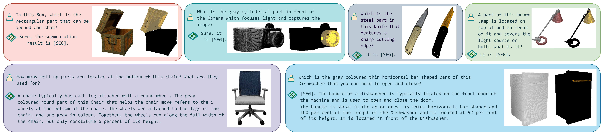

# PARIS3D: Reasoning-based 3D Part Segmentation Using Large Multimodal Model
<p align="center">

results on RPSeg dataset
</p>
This is the official implementation of "PARIS3D: Reasoning-based 3D Part Segmentation Using Large Multimodal Model".
We propose a model that is capable of segmenting parts of 3D objects based on implicit textual queries and generating natural language explanations corresponding to 3D object segmentation requests. Experiments show that our method achieves competitive performance to models that use explicit queries, with the additional abilities to identify part concepts, reason about them, and complement them with world knowledge.
<p align="center">

results on real-world point clouds
</p>

## Abstract 
Recent advancements in 3D perception systems have significantly improved their ability to perform visual recognition tasks such as segmentation. However, these systems still heavily rely on explicit human instruction to identify target objects or categories, lacking the capability to actively reason and comprehend implicit user intentions. We introduce a novel segmentation task known as reasoning part segmentation for 3D objects, aiming to output a segmentation mask based on complex and implicit textual queries about specific parts of a 3D object.
<p align="center">

PARIS3D Architecture
</p>

## Installation

### Create a conda envrionment and install dependencies.
```
conda env create -f environment.yml
conda activate paris3d
```
### Install LISA
```
pip install -r requirements.txt
pip install flash-attn --no-build-isolation
```
### Install PyTorch3D

We utilize [PyTorch3D](https://github.com/facebookresearch/pytorch3d) for rendering point clouds. Please install it by the following commands or its [official guide](https://github.com/facebookresearch/pytorch3d/blob/main/INSTALL.md):
```
pip install "git+https://github.com/facebookresearch/pytorch3d.git" 
```
### Install cut-pursuit
We utilize [cut-pursuit](https://github.com/loicland/superpoint_graph) for computing superpoints. Please install it by the following commands or its official guide:
```
CONDAENV=YOUR_CONDA_ENVIRONMENT_LOCATION
cd partition/cut-pursuit
mkdir build
cd build
cmake .. -DPYTHON_LIBRARY=$CONDAENV/lib/libpython3.9.so -DPYTHON_INCLUDE_DIR=$CONDAENV/include/python3.9 -DBOOST_INCLUDEDIR=$CONDAENV/include -DEIGEN3_INCLUDE_DIR=$CONDAENV/include/eigen3
make
```

## Quick-Demo
### Download pretrained checkpoints
You can find the pre-trained checkpoints from [here](https://huggingface.co/Amrinkar/PARIS3D).

### Inference
After downloading the checkpoint file, you can use the following command to run inference for them.
```
python3 run.py
```
The script will generate the following files:
```
rendered_img/: rendering of the input point cloud from 10 different views.
paris3d_pred/: 2D masks generated by PARIS3D for each view.
superpoint.ply: Generated super points for the input point cloud for converting masks to 3D segmentation. Different super points are in different colours.
semantic_seg/: visualization of semantic segmentation results for each part. Coloured in white or black.
```
### Evaluation
`sem_seg_eval.py` provides a script to calculate the mIoUs reported in the paper. 

## RPSeg Dataset
Our dataset comprises 2624 3D objects and over 60k instructions. We use 718 objects and their corresponding instructions as the train set, and the remaining 1906 objects along with their instructions are used for testing. For reliable and fair assessment, we have aligned the 3D objects with those from PartNet-Ensemble, annotating them with implicit text instructions and using ground truth labels to generate high-quality target masks.
You can find the dataset used in our paper from [here](https://huggingface.co/datasets/Amrinkar/RPSeg).
```
train: This is the reasoning data used for training the model. 
test: The test data is similar to [PartSLIP](https://arxiv.org/abs/2212.01558) but supported with text instructions.
Explanatory: A JSON file that supports the training data with detailed explanations.
PartNetE_meta.json: part names trained and evaluated of all 45 categories.

```
 
## Acknowledgements

Our work is heavily based on [PartSLIP](https://arxiv.org/abs/2212.01558) and [LISA](https://github.com/dvlab-research/LISA). 
```
@article{liu2022partslip,
  title={PartSLIP: Low-Shot Part Segmentation for 3D Point Clouds via Pretrained Image-Language Models},
  author={Liu, Minghua and Zhu, Yinhao and Cai, Hong and Han, Shizhong and Ling, Zhan and Porikli, Fatih and Su, Hao},
  journal={arXiv preprint arXiv:2212.01558},
  year={2022}
}
@article{lai2023lisa,
  title={LISA: Reasoning Segmentation via Large Language Model},
  author={Lai, Xin and Tian, Zhuotao and Chen, Yukang and Li, Yanwei and Yuan, Yuhui and Liu, Shu and Jia, Jiaya},
  journal={arXiv preprint arXiv:2308.00692},
  year={2023}
}
```
